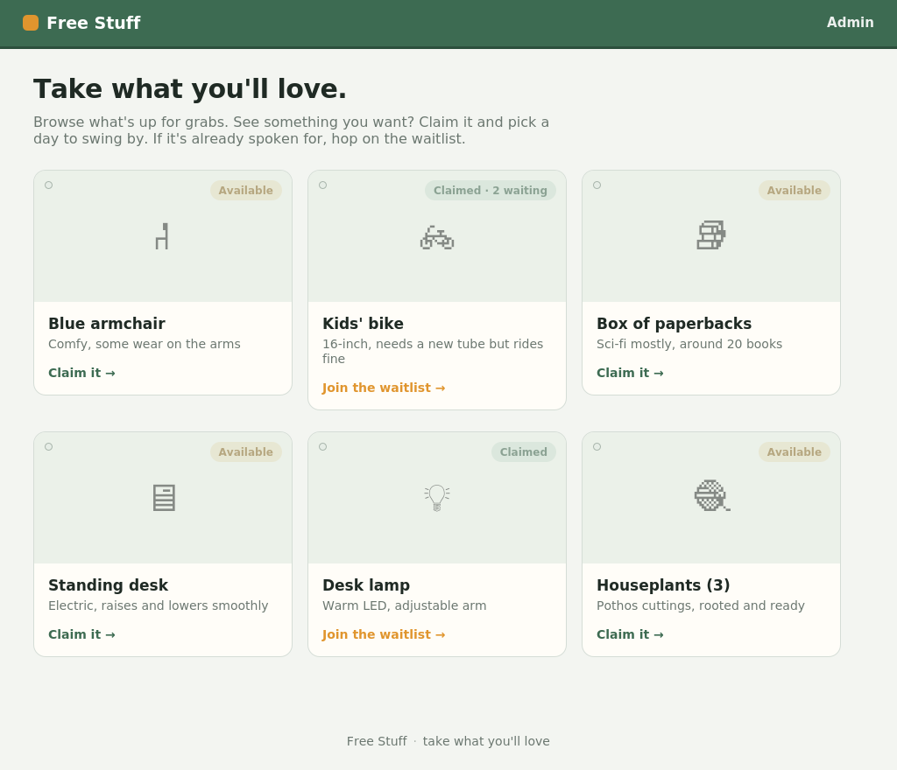
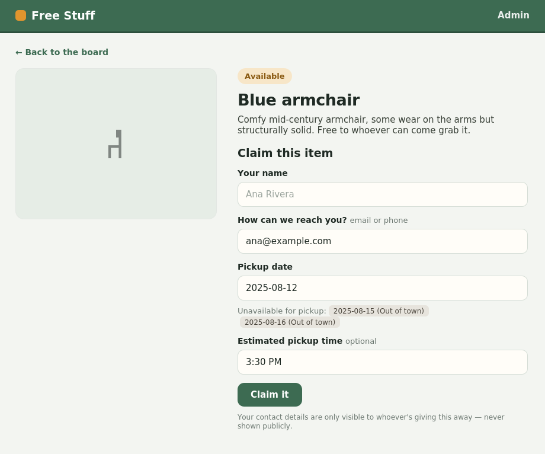

# FreeStuff

A tiny, self-hostable board for giving things away to friends. Post an item, let
people claim it, and keep an orderly waitlist for everyone after the first.




Flask + SQLite, no external services and no CDN calls. Runs as a single
container, so it's happy on a small VPS, a home server, or a Raspberry Pi.

## Features

- **Public board** — browse available items, claim one, or join its waitlist by
  leaving a name, contact, pickup date, and an optional estimated pickup time.
- **Ordered waitlist** — the first person to claim an item is the recipient;
  everyone after joins a waitlist and moves up automatically if someone drops.
- **Admin panel** — add, edit, and delete items (with photo upload), see the
  full queue with everyone's contact details, and mark items as given away.
- **Blackout dates** — block days when pickups can't happen (holidays, travel);
  they're steered away from on the form and enforced on the server.
- **iPhone photos just work** — HEIC uploads are converted to JPEG on the way in
  (which also strips GPS metadata, a nice privacy bonus).
- **Privacy first** — claimant contact details are only ever shown to the admin.
  Public pages just show *Available* / *Claimed · N waiting* / *Given away*.
- **Built-in safety** — CSRF protection, upload validation, autoescaped
  templates, and a private per-claim link people can use to withdraw themselves.



## How the claim / waitlist logic works

Each item has a queue of claims ordered by time. The **first active claim is the
recipient**; everyone after is the **waitlist**. This is computed live, so
there's nothing to get out of sync:

- First person to claim an available item → **first in line**.
- Anyone who claims after that → joins the **waitlist**.
- Admin removes the recipient (they flaked) → the next person **moves up
  automatically**.
- Admin clicks **Mark given away** → the item closes and drops off the board.

## Quick start (Docker Compose)

```bash
git clone https://github.com/<your-username>/freestuff.git
cd freestuff
cp .env.example .env

# generate a session secret and append it
python3 -c "import secrets; print('SECRET_KEY=' + secrets.token_hex(32))" >> .env
# then edit .env and set ADMIN_PASSWORD (and optionally SITE_NAME / SITE_TAGLINE)

docker compose up -d --build
```

The app listens on `127.0.0.1:8000`. Sign in at `/admin/login`. Data (the SQLite
database and uploaded photos) lives in the `freestuff_data` Docker volume, so it
survives restarts and rebuilds.

## Running locally (no Docker)

```bash
python3 -m venv .venv
source .venv/bin/activate
pip install -r requirements.txt

export ADMIN_PASSWORD='pick-something'
export SECRET_KEY="$(python3 -c 'import secrets;print(secrets.token_hex(32))')"
python3 app.py        # http://localhost:8000
```

## Configuration

All configuration is via environment variables (see `.env.example`):

| Variable        | Default                    | Purpose                                                    |
|-----------------|----------------------------|------------------------------------------------------------|
| `ADMIN_PASSWORD`| `changeme`                 | Password for `/admin/login`. **Set this.**                 |
| `SECRET_KEY`    | random per start           | Signs session cookies. **Set this** so logins survive restarts / multiple workers. |
| `SITE_NAME`     | `Free Stuff`               | Name shown in the header and page titles.                  |
| `SITE_TAGLINE`  | `Take what you'll love.`   | The line at the top of the public homepage.                |
| `MAX_UPLOAD_MB` | `8`                        | Max photo upload size.                                     |
| `DATA_DIR`      | `/data` (Docker) / `data`  | Where the database and uploads are stored.                 |

## Putting it behind HTTPS

The compose file binds the app to `127.0.0.1`, so it isn't exposed directly.
Point a reverse proxy at it. [Caddy](https://caddyserver.com/) is the least fuss
— it handles Let's Encrypt certificates automatically:

```
give.yourdomain.com {
    reverse_proxy 127.0.0.1:8000
}
```

Or with nginx (certificates via certbot):

```nginx
server {
    server_name give.yourdomain.com;
    client_max_body_size 10M;          # allow photo uploads
    location / {
        proxy_pass http://127.0.0.1:8000;
        proxy_set_header Host $host;
        proxy_set_header X-Forwarded-For $proxy_add_x_forwarded_for;
        proxy_set_header X-Forwarded-Proto $scheme;
    }
}
```

## Backups

Everything lives in one place — the data volume:

```bash
docker run --rm -v freestuff_data:/data -v "$PWD":/backup alpine \
    tar czf /backup/freestuff-backup-$(date +%F).tar.gz -C /data .
```

The SQLite file is `freestuff.db`; uploaded photos are under `uploads/`.

## Development

```bash
pip install -r requirements.txt -r requirements-dev.txt
python -m pytest
```

CI runs the test suite on Python 3.9, 3.11, and 3.12.

## Project layout

```
app.py               # the whole application (routes, auth, claim logic)
schema.sql           # database schema
templates/           # Jinja2 templates
static/style.css     # styling
tests/               # pytest suite
Dockerfile
docker-compose.yml
```

## Scope & notes

Built deliberately small for a friends-and-family use case:

- Admin is a single shared password — fine behind HTTPS for a private board.
  Per-user admin accounts would be the natural next step.
- No email/SMS notifications; the admin sees contacts in the queue and reaches
  out directly.

Contributions welcome — see [CONTRIBUTING.md](CONTRIBUTING.md).

## License

[MIT](LICENSE)
